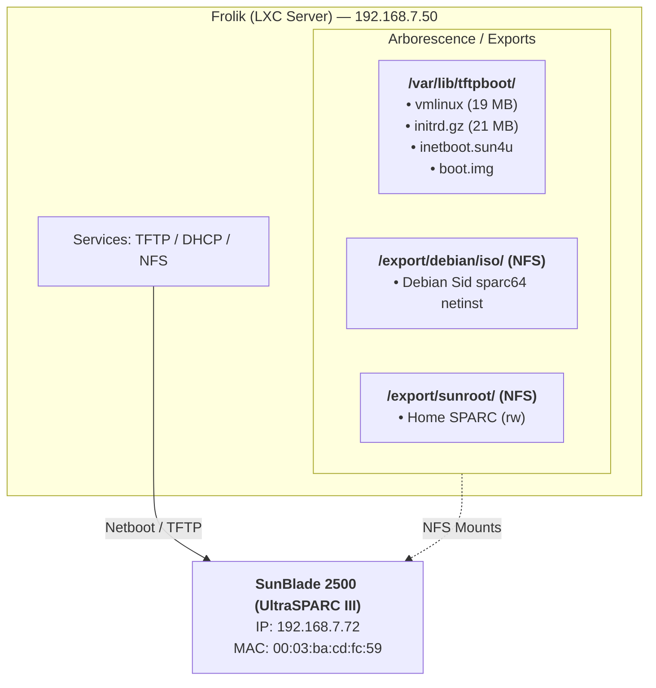

# UltraSPARC-III

```mermaid
graph TD
    subgraph Server["Frolik (LXC Server) — 192.168.7.50"]
        DHCP["Services: TFTP / DHCP / NFS"]
        
        subgraph Storage["Arborescence / Exports"]
            TFTP["<b>/var/lib/tftpboot/</b><br/>• vmlinux (19 MB)<br/>• initrd.gz (21 MB)<br/>• inetboot.sun4u<br/>• boot.img"]
            ISO["<b>/export/debian/iso/ (NFS)</b><br/>• Debian Sid sparc64 netinst"]
            ROOT["<b>/export/sunroot/ (NFS)</b><br/>• Home SPARC (rw)"]
        end
    end

    Client["<b>SunBlade 2500 (UltraSPARC III)</b><br/>IP: 192.168.7.72<br/>MAC: 00:03:ba:cd:fc:59"]

    DHCP -->|Netboot / TFTP| Client
    Storage -.->|NFS Mounts| Client
```
