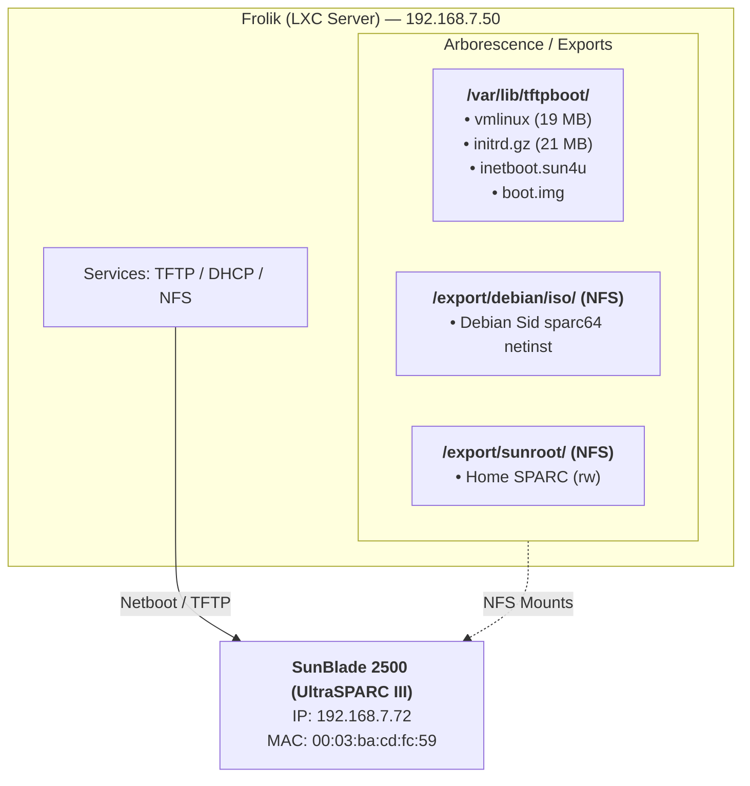

# UltraSPARC-III : architecture en place

Pour booter le SunBlade

  1. Connecter le SunBlade sur le même switch/réseau que le LAN 192.168.7.x
  2. Allumer la machine et interrompre le boot au prompt OBP :
  Sun Blade 2500 ...
  ok
  3. Lancer le boot réseau :
  ok boot net:dhcp
  4. L'OBP va :
     
    - Faire DHCP → obtenir IP 192.168.7.50
    
    - Télécharger vmlinux via TFTP depuis 192.168.7.72
    
    - Charger le kernel + initrd
    
    - Lancer l'installateur Debian
    
  6. Pendant l'install, les dépôts NFS sont disponibles :
     
    - Installer via NFS : chemin 192.168.7.72:/export/debian/iso
    
    - Root Debian pour le système final : /export/sunroot
    
Apres l'install

| Commande | Description |
| :--- | :--- |
| `ok boot net:dhcp` | Boot réseau DHCP |
| `ok boot net` | Boot réseau RARP |
| `ok probe-scsi` | Lister disques SCSI |
| `ok printenv boot-device` | Voir le boot device actuel |
| `ok setenv boot-device net:dhcp` | Boot réseau par défaut |
| `ok show-nets` | Lister les interfaces réseau |
| `ok test net` | Tester la carte réseau |
